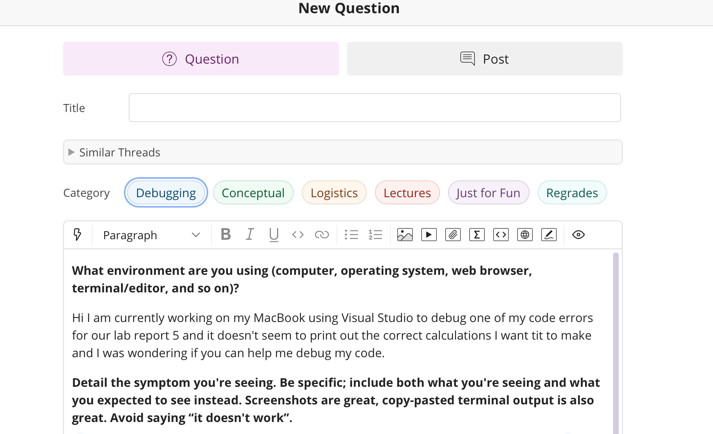
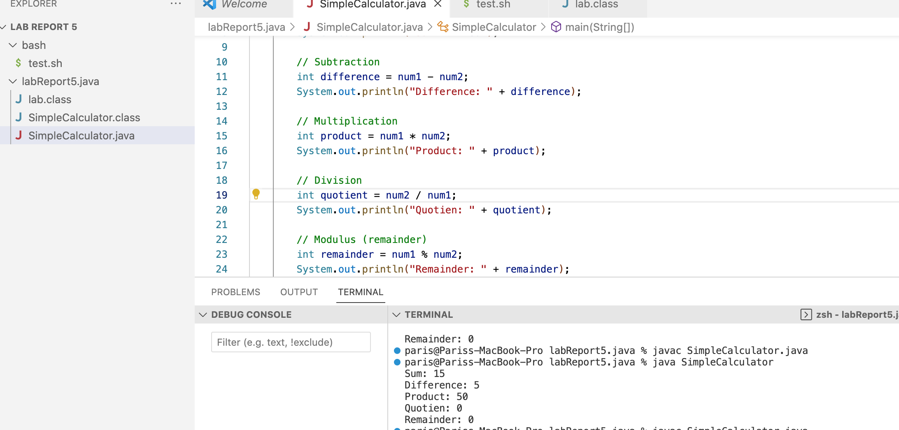
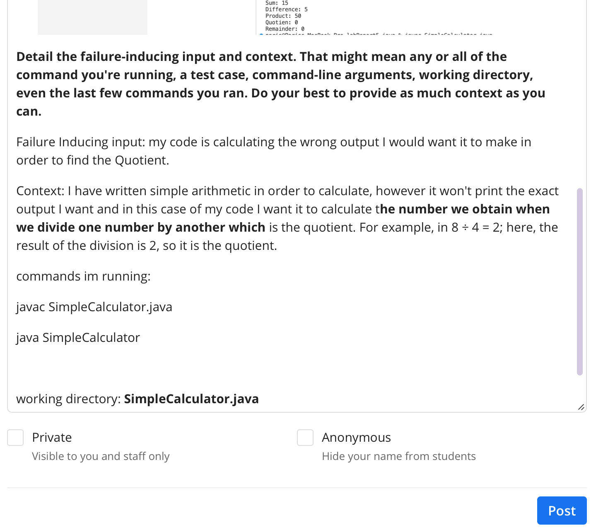
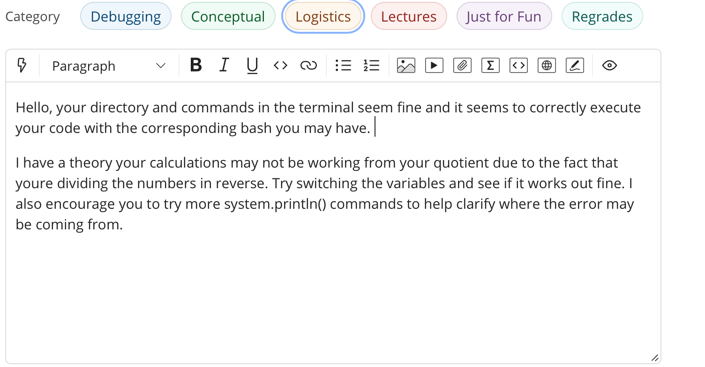
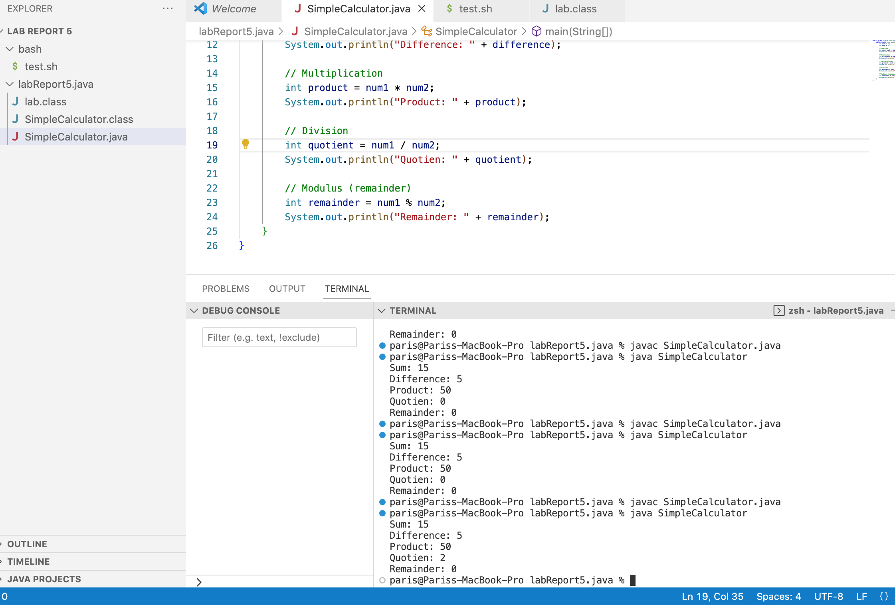
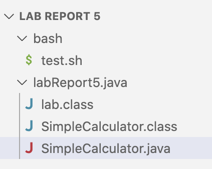
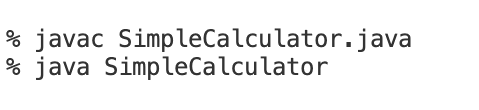
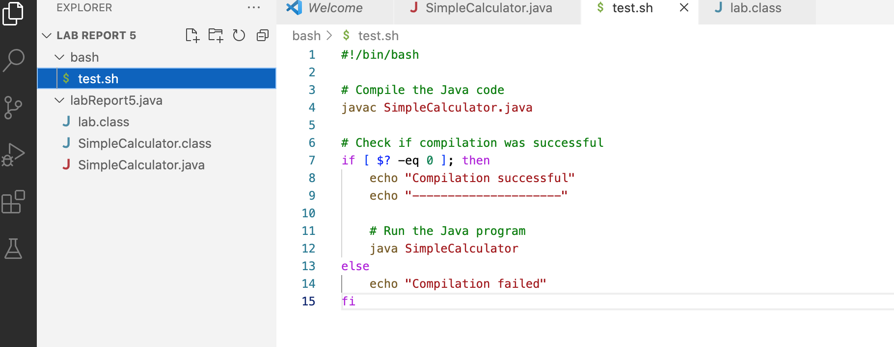
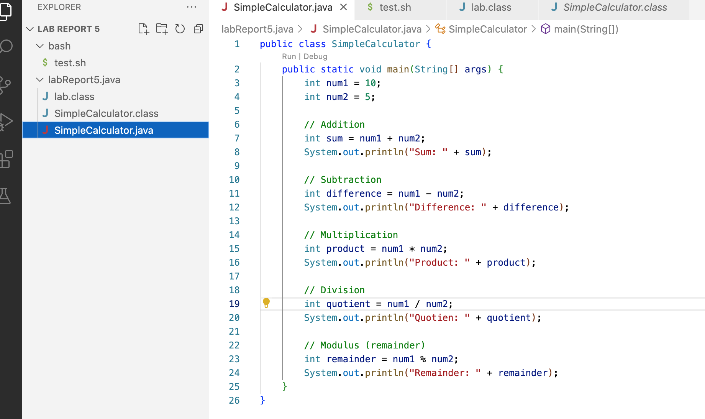

LAB REPORT 5
===

Part 1.1
---

> most recent post by a student in edStem

Part 1.2
---

> TA respnse to this student

Part 1.3
---

> output of what student got by taking the TA advice

Bug discription: The bug occurs because the division is performed by dividing num2 by num1, whereas the intention is to divide num1 by num2. For example 
let's assume num1 is 10 and num2 is 5. With the original code, the division would be calculated as 5 / 10, which results in 0.5. However, since both num1 and num2 are integers, 
the division is an integer division, and any fractional part is truncated. As a result, the calculated quotient would be 0 instead of the expected 2.

Part 1.4
---

> The `file` & `directory` structure needed:
> 
> `file:` 
> 
> 
> 
> `directory:`
> 
> 

> The `contents` of each file before fixing the bug
> 
> `bash file` contents:
> 
> 
> 
> `SimpleCalculator.java` file contents:
> 
> 

> The `full command line` (or lines) you ran to trigger the bug:
>
>

> A `description` of what to edit to fix the bug:
> 
> In this code, the division calculation to find the quotient is incorrect. Instead of dividing num1 by num2, the code attempts to divide num2 by num1. By simply switching the variables it will perform the corrct arithmatic operation.

Part 2
---

For the second half of this quarter I learned a lot about vim and how it works as a text editor.I learned some intresting commands such as `x` for deleting lines, and `i` to go into "insert mode" which allowed me to freely type what I wanted in certain texts. Something new to me about this environment is the commands of navigation using `h`, `j`, `k`, and `l` on my keyboard. I was captivated by Vim's different commandssince it was minimal effort to go through tasks. The experience was was fun since the code editing was more fun and enjoyable. Learning Vim is definetly one of the hglights of this class for me something new and refreshing to enjoy even on my free time to try the commands. maybe because im new to it and it will probably go away in a month or two.
